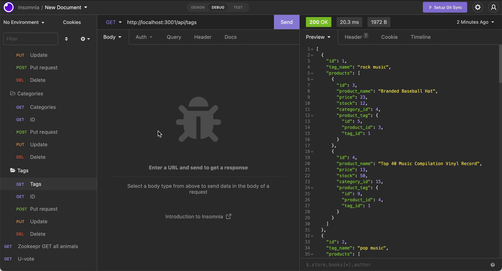

# E-Commerce Back End

   

- [E-Commerce Back End](#e-commerce-back-end)
  - [User Story](#user-story)
  - [Description](#description)
  - [Installation](#installation)
  - [License](#license)
  - [GitHub Repo](#github-repo)
  - [Link to video of working app](#link-to-video-of-working-app)
  - [Questions](#questions)

## User Story
    AS A manager at an internet retail company
    I WANT a back end for my e-commerce website that uses the latest technologies
    SO THAT my company can compete with other e-commerce companies

  ## Description
    GIVEN a functional Express.js API
    WHEN I add my database name, MySQL username, and MySQL password to an environment variable file
    THEN I am able to connect to a database using Sequelize
    WHEN I enter schema and seed commands
    THEN a development database is created and is seeded with test data
    WHEN I enter the command to invoke the application
    THEN my server is started and the Sequelize models are synced to the MySQL database
    WHEN I open API GET routes in Insomnia for categories, products, or tags
    THEN the data for each of these routes is displayed in a formatted JSON
    WHEN I test API POST, PUT, and DELETE routes in Insomnia
THEN I am able to successfully create, update, and delete data in my database

    
  ## Installation
    -Clone the repo
    -Install node.js: https://coding-boot-camp.github.io/full-stack/nodejs/how-to-install-nodejs
    -Then in the integrated terminal for the cloned repo terminal:
      -npm install
      -use schema.sql as source
      -npm run seed
      -npm start

  ## License
      
   

      This project is coverted under the MIT License

  ## GitHub Repo
   https://github.com/jleitz27/e-commerce-back-end  

  ## Link to video of working app
 https://www.screencast.com/t/U4CpuDfN  

  
  

  ## Questions

  If you have any additional questions please contact me:  
      - GitHub: jleitz27  (https://github.com/jleitz27)
      - Email:  jkleitz27@gmail.com